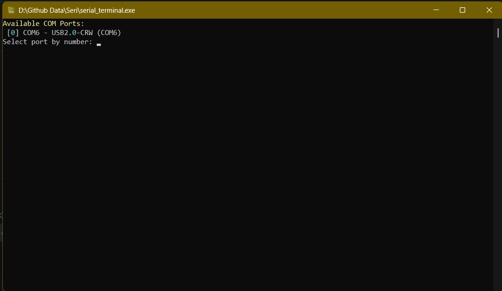

# Seri - Serial Terminal

A command-line based serial terminal written in Python. This tool allows you to communicate with devices over a serial port (e.g. Arduino, ESP, Pi Pico, etc.) directly from your Windows command prompt or terminal.

---

## 📐 Technology

- Python
- Python Package = Rich

---

## ⚙️ Features

- Cross-platform Python serial terminal
- Colored command prompt and timestamped responses
- Works with USB/COM ports
- Supports auto-port selection
- Logs all incoming messages to a file
- Can be compiled to a standalone `.exe`

---

## 🚀 How to Use (EXE version)

0. Connect your Device Before Hand
1. Double-click `serial_terminal.exe` **OR**
2. Run from CMD:
   ```
   serial_terminal.exe --port COM3 --baud 9600
   ```
3. If no port is specified, it will list available COM ports to choose from.
4. Type your message and hit ENTER to send.
5. Type `exit` or press `Ctrl+C` to quit.

---

## 📝 Log File

All incoming serial data is saved automatically in:
```
serial_log.txt
```

---

## 💻 Building from Source (optional)

1. Install Python 3.10+
2. Install dependencies:
   ```
   pip install pyserial rich
   ```
3. Run:
   ```
   python serial_terminal.py
   ```

To make a `.exe`:
```
pip install pyinstaller
pyinstaller --onefile --icon=serial_terminal_icon.ico serial_terminal.py
```



---

## ⚠️ Disclaimer

This software is provided "AS IS", without warranty of any kind.

> I hold **no responsibility** for any damage, data loss, or issues caused by the use of this software — even if licensed under MIT.

Use it at your own risk.

---

© 2025 Aditya Yadav — MIT License
